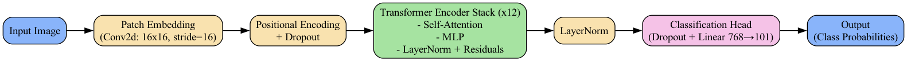

# Temporal Vision Transformer with LoRA - UCF101 Training

[](https://huggingface.co/detker/temporal-vit-85M)




## 📋 Table of Contents

- [Overview](#overview)
- [Setup & Usage](#setup-&-usage)
- [Training](#training)
- [Notebooks](#notebooks)

## 🔎 Overview

This repository contains the implementation of a Vision Transformer (ViT) model from scratch fine-tuned with LoRA (Low-Rank Adaptation) for temporal video classification on the UCF101 dataset. The project leverages Hugging Face's `accelerate` framework for efficient training and evaluation.

### Key Features
- **Temporal Video Classification**: Handles video data with temporal dynamics.
- **LoRA Integration**: Efficient fine-tuning of large models with low-rank adaptation.
- **Customizable Training**: Supports various hyperparameters and configurations.
- **Distributed Data Parallelism**: Training can be performed on a multi-GPU setup using the `accelerate` library.
- **Ready-to-Go Inference**: Supports loading model through Hugging Face's `transformers` library

### 📂 Project Structure
```
.
├── src/
├── notebooks/
├── wandb/
├── data/
│   ├── train/
│   ├── val/
│   └── test/
├── working_directory/
│   └── experiment_name/
│       └── checkpoints/
```

### 📦 Model Weights
Pretrained model weights are available on Hugging Face: [ViT-LoRA Temporal Weights](https://huggingface.co/detker/temporal-vit-85M)

You can load the model using Hugging Face's `AutoModel` and `AutoConfig` classes:

```python
from transformers import AutoModel, AutoConfig
from hf_pretrained_model import TemporalViTConfig, TemporalViTHF

# Register model
AutoConfig.register('temporal-vit', TemporalViTConfig)
AutoModel.register(TemporalViTConfig, TemporalViTHF)

# Load the model
model = AutoModel.from_pretrained('detker/temporal-vit-85M',
                                  trust_remote_code=True)

# Example usage
inputs = ...  # Prepare your input tensor
outputs = model(inputs)
```

## ⚙️ Setup & Usage

### Prerequisites
Ensure you have the following installed:
- `Python 3.11.4`
- `Conda 23.7.3`
- `PyTorch` (compatible with your GPU/CPU setup)


### Installation
Clone the repository and set up the environment:
```bash
git clone https://github.com/detker/Temporal-Vision-Transformer-LoRA
cd Temporal-Vision-Transformer-LoRA
conda create -n vit_lora python=3.11.4
conda activate vit_lora
pip install -r requirements.txtl
```

#### Dataset Preparation
Download the UCF101 dataset and organize it into `train` and `val` folders. Use the provided `download_data.sh` script to automate the process:

```bash
chmod +x download_data.sh
./download_data.sh
```

## 🚀 Training 
The available weights were obtained by training on a single RTX 5090 GPU for approximately 150 epochs.  

Possible improvements include:  
+ Further training, as both training and testing losses continue to decrease.  
+ Increasing the number of frames the model processes.  
+ Making the framing process more intelligent.  
+ Training on a larger dataset with significantly more classes.  

Below we present loss visualization taken from wandb platform.


To train the model, use the `train_script.sh` shell script. Customize the training parameters in the script as needed. Example:

```bash
chmod +x train_script.sh
./train_script.sh
```

Training parameters include:

| **Parameter**               | **Description**                                                 | **Default**       | **Type**            |
|-----------------------------|-----------------------------------------------------------------|-------------------|---------------------|
| `--experiment_name`         | Name of Experiment                                              | **Required**      | `str`               |
| `--path_to_data`            | Path to UCF101 root folder containing `train` and `val` folders | **Required**      | `str`               |
| `--working_directory`       | Directory for checkpoints and logs                              | **Required**      | `str`               |
| `--checkpoint_dir`          | Directory for checkpoints                                       | **Required**      | `str`               |
| `--hf_model_name`           | Base Google's ViT HF model name                                 | **Required**      | `str`               |
| `--lora_rank`               | Rank of the LoRA adaptation matrices                            | `8`               | `int`               |
| `--lora_alpha`              | Alpha scaling factor for LoRA                                   | `8`               | `int`               |
| `--lora_use_rslora`         | Whether to use RS-LoRA                                          | `False`           | `bool`              |
| `--lora_dropout`            | Dropout rate for LoRA                                           | `0.1`             | `float`             |
| `--lora_bias`               | Bias configuration for LoRA                                     | `'none'`          | `str` (choices: `none`, `lora_only`, `all`) |
| `--lora_target_modules`     | Comma-separated list of target modules for LoRA                 | **None**          | `list`              |
| `--lora_exclude_modules`    | Comma-separated list of modules to exclude from LoRA            | **None**          | `list`              |
| `--epochs`                  | Number of Epochs                                                | `300`             | `int`               |
| `--warmup_epochs`           | Number of warmup Epochs                                         | `30`              | `int`               |
| `--save_checkpoint_interval`| Interval (in epochs) to save model checkpoints                  | `1`               | `int`               |
| `--per_gpu_batch_size`      | Batch size per GPU                                              | `256`             | `int`               |
| `--gradient_accumulation_steps` | Number of gradient accumulation steps                           | `1`               | `int`               |
| `--learning_rate`           | Max Learning rate for cosine scheduler                          | `0.003`           | `float`             |
| `--weight_decay`            | Weight decay for optimizer                                      | `0.1`             | `float`             |
| `--label_smoothing`         | Smooths labels when computing loss                              | `0`               | `float`             |
| `--custom_weight_init`      | Initialize the model with truncated normal layers               | `False`           | `bool`              |
| `--bias_weight_decay`       | Apply weight decay to bias                                      | `False`           | `bool`              |
| `--norm_weight_decay`       | Apply weight decay to normalization weight and bias             | `False`           | `bool`              |
| `--max_grad_norm`           | Maximum norm for gradient clipping                              | `1.0`             | `float`             |
| `--img_size`                | Width and Height of frames passed to model                      | `224`             | `int`               |
| `--num_workers`             | Number of workers for DataLoader                                | `32`              | `int`               |
| `--adam_beta1`              | Beta1 parameter for Adam optimizer                              | `0.9`             | `float`             |
| `--adam_beta2`              | Beta2 parameter for Adam optimizer                              | `0.999`           | `float`             |
| `--adam_epsilon`            | Epsilon parameter for Adam optimizer                            | `1e-8`            | `float`             |
| `--log_wandb`               | Log metrics to Weights & Biases                                 | `False`           | `bool`              |
| `--resume_from_checkpoint`  | Checkpoint folder to resume training from                       | **None**          | `str`               |
| `--top_k`                   | Top-k classes to retrieve during accuracy calculation            | `5`               | `int`               |
| `--max_no_of_checkpoints`   | Max number of latest checkpoints to store on disk               | `10`              | `int`               |
| `--n_frames`                | Constant number of frames to extract from each clip             | `8`               | `int`               |


Checkpoints are saved periodically in the `{working_directory}/{experiment_name}/{checkpoint_dir}` directory.


The evaluation metrics include:
+ **accuracy@1**: Accuracy of the top prediction.
+ **accuracy@k**: Accuracy of the top-k predictions.

## 🧪 Notebooks

Explore the `inference/` directory for a quick inference demo notebook.
We also provide simple, interactive gradio demo.
